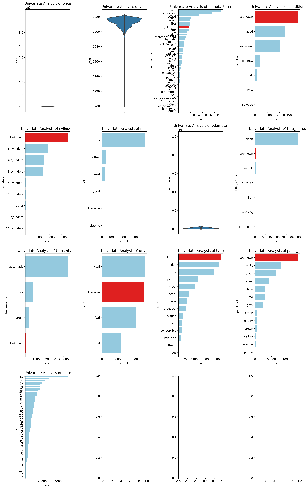

# Used Car Analysis

Berkeley AI/ML Assignment 11.1: What Drives the Price of a Car?

[Juypter Notebook](https://github.com/hemant280/used-car-analysis/blob/main/analysis.ipynb).

**OVERVIEW**

In this application, you will explore a dataset from Kaggle. The original dataset contained information on 3 million used cars. The provided dataset contains information on 426K cars to ensure speed of processing.  Your goal is to understand what factors make a car more or less expensive.  As a result of your analysis, you should provide clear recommendations to your client -- a used car dealership -- as to what consumers value in a used car.

# Business Understanding

From a business perspective, we are tasked with identifying key drivers for used car prices.  In the CRISP-DM overview, we are asked to convert this business framing to a data problem definition.  Using a few sentences, reframe the task as a data task with the appropriate technical vocabulary. 

# Goal

- Identify the features of the used car which are significiant in predeciting price?
- How well the features describes the price of the car

# Data

This data comes to us from the Kaggle, The original dataset contained information on 3 million used cars. The provided dataset contains information on 426K cars to ensure the speed of processing.

## Data Description

Keep in mind that these values mentioned below are average values.

The attributes of this data set include:
- Id: Uniq ID for the record
- Region: Region where car is sold (MSA: Metropolitan statistical area )
- Price: saling price of the car
- Year: Year, car was manufactured
- Manufacturer: Name of the Manufacturer (Example: ford, chevrolet, toyota, honda)
- Model: Car Model (Example: f-150, silverado 1500, 1500, camry, silverado)
- Condition: Condition of the car when sold (Example: good, excellent, like new, fair, new, salvage)
- Cylinders: Cylinders (Example: 6 cylinders, 4 cylinders, 8 cylinders, 5 cylinders,others)
- Fuel: Fuel Type (Example: gas, other, diesel, hybrid, electric)
- Odometer: Odometer reading when car was sold
- Title_status: Status of the title (Example: clean, rebuilt, salvage, lien, missing, parts only)
- Transmission: Car Transmission type (Example: automatic, other, manual)
- Vin: Vechial Identification Numer, uniq number assined to vechile by Manufacturer
- Drive: Drive type (Example: 4wd, fwd, rwd)
- Size: Vechile size (Example: full-size, mid-size, compact, sub-compact)
- Type: Type of Vechile (Example: sedan, SUV, pickup, truck, other)
- Paint_color: Color of the car when sold (Example: white, black, silver, blue,etc.)
- State: US State where car was sold

## ALL columns with % of missing values

All Column with % of missing values
- id: 0.00% missing values
- region: 0.00% missing values
- price: 0.00% missing values
- year: 0.28% missing values
- manufacturer: 4.13% missing values
- model: 1.24% missing values
- condition: 40.79% missing values
- cylinders: 41.62% missing values
- fuel: 0.71% missing values
- odometer: 1.03% missing values
- title_status: 1.93% missing values
- transmission: 0.60% missing values
- VIN: 37.73% missing values
- drive: 30.59% missing values
- size: 71.77% missing values
- type: 21.75% missing values
- paint_color: 30.50% missing values
- state: 0.00% missing values

## Categorical Columns with %of missing values

- region: 0.00% missing values
- manufacturer: 4.13% missing values
- model: 1.15% missing values
- condition: 39.29% missing values
- cylinders: 37.84% missing values
- fuel: 0.71% missing values
- title_status: 2.10% missing values
- transmission: 0.47% missing values
- VIN: 41.16% missing values
- drive: 29.32% missing values
- size: 69.96% missing values
- type: 23.00% missing values
- paint_color: 30.20% missing values
- state: 0.00% missing values

## Data Preparation

**Univariant Analysis**

- Based on the univariat analysis, scopping the data to limimted values of vechicle models and title_status:
    - Limiting the scope of the model to:
        - Vechicle Model 
            - sedan
            - SUV
            - pickup
            - truck
            - coupe
            - hatchback
            - van
            - wagon
            - convertible
            - minivan
        - title_status
            - clean

### Modeling

- Split the data into three sets 
    - train (70%), 
    - develop (20%) 
    - test/validate(10%)
- Polynomial regression model with degree 3 has the lowest MSE    

# Recommendations 

Based on my analysis of the used car dataset containing 426K vehicles, below is my  recommendations to your used car dealership about what consumers value in a used car. 

Here are the key findings and strategic recommendations:

## Key Findings from the Analysis

__Data Scope__: The analysis focused on the most popular vehicle types (sedan, SUV, pickup, truck, coupe, hatchback, van, wagon, convertible, minivan) with clean titles, filtering out outliers and vehicles over $300K.

__Model Performance__: A polynomial regression model with degree 3 was identified as optimal, using feature selection to identify the top 5 most predictive features for used car pricing.

## Primary Recommendations for Your Dealership

### 1. __Focus on Vehicle Fundamentals__

The analysis shows that the most significant price drivers are encoded features from core vehicle attributes:

- __Manufacturer__ (4.13% missing values - manageable)
- __Model__ (1.24% missing values - reliable data)
- __Year__ (0.28% missing values - excellent data quality)
- __Odometer reading__ (1.03% missing values - reliable indicator)

__Recommendation__: Prioritize inventory with complete, accurate information on these fundamental characteristics as they are the strongest predictors of value.

### 2. __Vehicle Type Strategy__

The analysis specifically focused on high-demand vehicle types:

- Sedans, SUVs, and pickup trucks should be your core inventory
- These vehicle types have sufficient market data and consumer demand
- Avoid niche vehicle types with limited market appeal

### 3. __Title Status is Critical__

The analysis was limited to vehicles with "clean" title status for good reason. __Recommendation__: Focus heavily on clean title vehicles as they represent the most marketable and valuable segment of the used car market.

### 4. __Data Quality Drives Value__

The analysis revealed significant missing data issues:

- __Condition__: 40.79% missing values
- __Cylinders__: 41.62% missing values
- __Drive type__: 30.59% missing values
- __Size__: 71.77% missing values
- __Paint color__: 30.50% missing values

__Recommendation__: Invest in complete vehicle inspections and documentation. Vehicles with complete information will be more accurately priced and easier to sell.

### 5. __Inventory Filtering Strategy__

Based on the outlier removal in the analysis:

- Avoid vehicles priced over $300,000 (limited market)
- Avoid vehicles with odometer readings over 300,000 miles
- These represent edge cases that don't follow normal market patterns

## Strategic Implementation

### Immediate Actions:

1. __Audit your current inventory__ for data completeness on manufacturer, model, year, and odometer
2. __Prioritize clean title vehicles__ in acquisition decisions
3. __Focus on mainstream vehicle types__ (sedan, SUV, pickup, truck, coupe, hatchback)

### Pricing Strategy:

1. Use the identified key features (manufacturer, model, year, odometer) as primary pricing factors
2. Ensure complete vehicle documentation to maximize pricing accuracy
3. Consider the polynomial relationship between features - pricing isn't always linear

### Inventory Management:

1. Maintain detailed records for all vehicles
2. Avoid vehicles with incomplete documentation
3. Focus on the vehicle types that showed strong market presence in the analysis

This data-driven approach will help you optimize your inventory for maximum profitability while meeting consumer demand patterns identified in the comprehensive analysis of 426K vehicle transactions.
